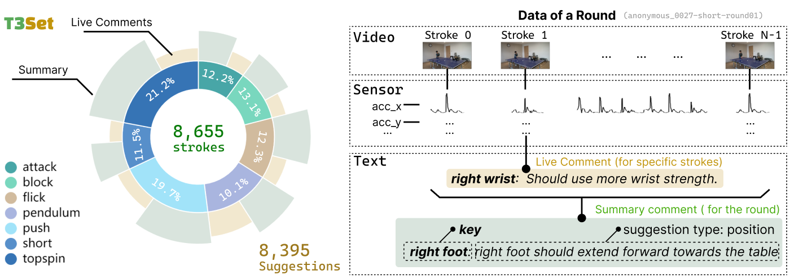

# T3Set:  Table Tennis Training
*Official Repository for [KDD'25](https://kdd2025.kdd.org/) (Dataset and Benchmark Track) Paper "A Multimodal Dataset with Targeted Suggestions for LLM-based Virtual Coach in Table Tennis Training "*  

<div align="center">
  <a href="https://zenodo.org/records/15516144"></a>  
  <a href="https://doi.org/10.1145/3711896.3737407"></a>  
  <br>
      
</div>  


## 🌟 Overview  
T3Set (<b>T</b>able <b>T</b>ennis <b>T</b>raining) is a multimodal dataset with aligned video-sensor-text data in table tennis training, designed for LLM-based virtual coach research.  

### Key Features  
-  Temporal alignment between sensor data (IMU), multi-angle video, and professional coaching text  
-  High-quality targeted suggestions following a predefined suggestion taxonomy


## 📊 Data Statistics  
| Dimension            | Details                                                                                                         |  
|----------------------|-----------------------------------------------------------------------------------------------------------------|  
| Participants         | 32 amateur players                                                                                              |  
| Training Rounds      | 380 multi-ball training rounds                                                                                  |  
| Strokes              | 8,655 labeled strokes                                                                                           |  
| Technique            | 7 common techniques (topspin, block, etc.)                                                                      |
| Targeted Suggestions | 8,395 coach suggestions                                                                                         |  
| Modal Data           | - Video: 1080p@60fps, two-camera <br>- Sensor: 9-axis IMU (100Hz sampling) <br>- Audio: coaches' audio and text |  


## 📦 Dataset Access  
The dataset is publicly available on [Zenodo](https://zenodo.org/records/15516144):  
```shell
# Access link
https://zenodo.org/records/15516144
# Permanent DOI link  
https://doi.org/10.5281/zenodo.15516143  
```  

⚠️ **Ethics Statement**:  
- All participants provided informed consent for open-source usage.
- Experimental procedures approved by the laboratory ethics review committee.

## 📃Paper Access
The paper is available on [ACM DL](https://dl.acm.org/doi/10.1145/3711896.3737407):
```shell
# Access link
https://dl.acm.org/doi/10.1145/3711896.3737407
``` 

## 💻  Model and Scripts  
### Directory Structure  
```  
T3Set/  
├─ models/            # A simple model to validate the usage of dataset 
│  ├─ src/        # src code
│  ├─ weights/     # Pre-trained weights 
│  ├─ requirements.txt     # required packages  
│  └─ README.md              # usage instructions
├─ scripts/           # Data processing & evaluation scripts  
│  ├─ data_scripts/  # scripts for building dataset (stroke detection, data alignment, text preprocessing)  
│  └─ eval_scripts/  # Benchmark testing script 
├─ README.md          # Project overview
└─ LICENSE            # License information

```  


## 📖 Citation  
If you find this dataset useful, please cite our paper:  
```bibtex  
@inproceedings{ma2025t3set,
author = {Ma, Ji and Wu, Jiale and Wang, Haoyu and Zhang, Yanze and Xie, Xiao and Zhou, Zheng and Zhang, Hui and Wang, Jiachen and Wu, Yingcai},
title = {T3Set: A Multimodal Dataset with Targeted Suggestions for LLM-based Virtual Coach in Table Tennis Training},
year = {2025},
publisher = {Association for Computing Machinery},
address = {New York, NY, USA},
doi = {10.1145/3711896.3737407},
booktitle = {Proceedings of the 31st ACM SIGKDD Conference on Knowledge Discovery and Data Mining V.2},
pages = {5686–5697},
numpages = {12},
location = {Toronto ON, Canada},
series = {KDD '25}
}
```  


## 🤝 Acknowledgments  
Thanks to all players and coaches involved in data collection!


## 📢 Contact  
For questions or collaborations, contact:  
- Ji Ma: zjumaji@zju.edu.cn  
